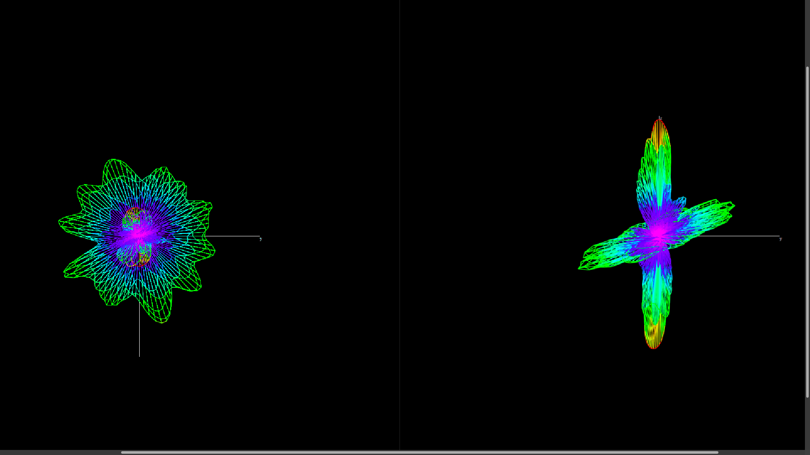

Author: Jacob Dawson

# evolveAntenna
The idea here is to either make an evolutionary algorithm (or some other kind of optimiziation algorithm?) in order to design radio antennae to certain parameters!

# Requirements:
1. Python3
2. necpp, a python library I found here: https://github.com/tmolteno/necpp for simulating antenna behavior. Weirdly, I couldn't get this to work on windows, so I recommend a linux-based operating system for this, I guess
3. scipy, for scientific processing. We'll be using its optimization functions to do some quick antenna-designing
4. shapely, which is a geometry library which we're using to make sure that we aren't getting our wires crossed

Massive thanks to Timothy Molteno, whose NEC++ rewrite into C++ and Python made this project possible. The repository here https://github.com/tmolteno/necpp asks that I credit that work like so:
Timothy C.A. Molteno, ''NEC2++: An NEC-2 compatible Numerical Electromagnetics Code'', Electronics Technical Reports No. 2014-3, ISSN 1172-496X, October 2014.
